# Smart Assistant for Learners — Системийн диаграммууд

---

## 0. Weaviate Vector DB — Chunk хадгалалтын бүтэц

### 0.1 PostgreSQL vs Weaviate — Chunk өгөгдлийн хуваарилалт

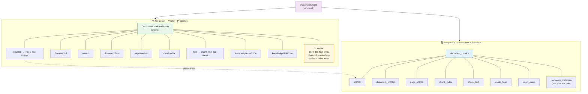

---

### 0.2 Chunk индексийн урсгал (Upload → Weaviate)

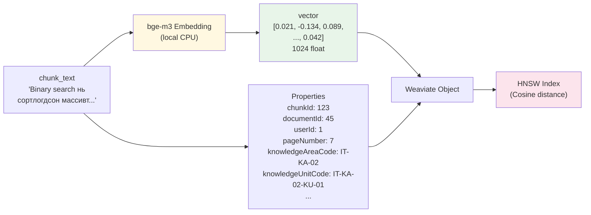

---

### 0.3 Semantic Search урсгал (Query → Top-K chunks)

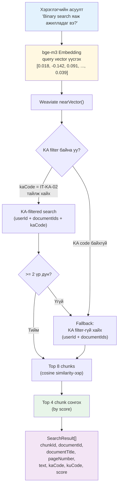

---

## 0. Taxonomy бүтцийн диаграмм

### 0.1 IT Body of Knowledge — Ерөнхий бүтэц (12 KA)

> ⬛ = Core (MVP-д заавал), ⬜ = Optional

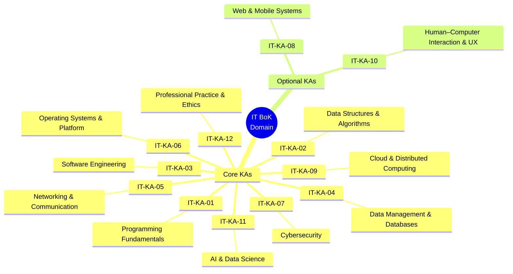

---

### 0.2 Taxonomy шатлалын бүтэц — Нэг KA-ийн жишээ (IT-KA-01)

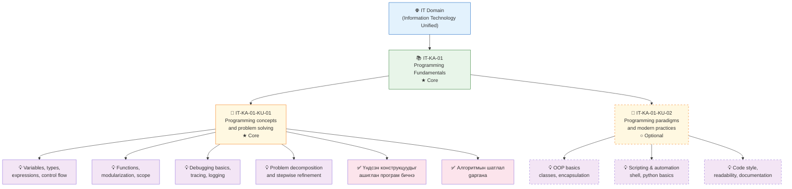

---

### 0.3 Taxonomy → Системд хэрхэн ашиглагдах

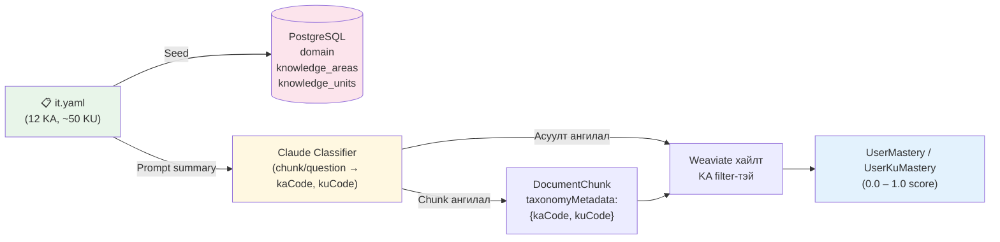

---

## 1. User Flow Diagram — Хэрэглэгчийн урсгал

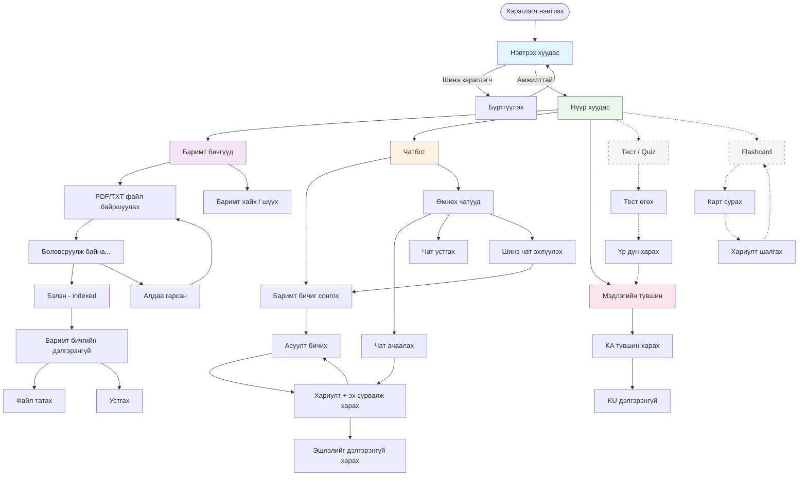

---

## 1.1 Document Upload Workflow — Баримт бичиг байршуулах урсгал

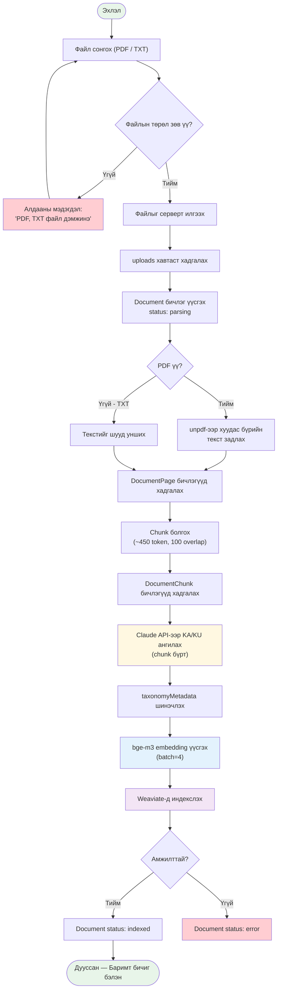

---

### Зураг 5.2.1.2. Ingestion pipeline-ийн урсгал диаграмм

```mermaid
flowchart TD
    A([Эхлэл: Upload request]) --> B[JWT шалгах + файл валидлах]
    B --> C{"Файл зөв үү - PDF эсвэл TXT"}
    C -->|Үгүй| X[400 Bad Request]
    C -->|Тийм| D[uploads/ руу хадгалах]

    D --> E[documents хүснэгтэд бичлэг үүсгэх<br/>status: parsing]
    E --> F{Source type}

    F -->|PDF| G[unpdf.extractText()<br/>хуудас бүрээс текст авах]
    F -->|TXT| H[текстийг нэг хуудсаар унших]
    G --> I[document_pages хадгалах]
    H --> I

    I --> J[chunk-text()<br/>~338 words, overlap 75]
    J --> K[document_chunks хадгалах]

    K --> L[classifyChunks()<br/>KA/KU ангилал]
    L --> M[taxonomyMetadata update]

    M --> N[embedTextBatch()<br/>bge-m3, batch=4]
    N --> O[Weaviate DocumentChunk upsert]

    O --> P{"Индекслэлт амжилттай юу"}
    P -->|Тийм| Q[documents.status = indexed]
    P -->|Үгүй| R[documents.status = error]

    Q --> S([Дууссан: Retrieval-д бэлэн])
    R --> T([Дууссан: Retry/Reclassify шаардлагатай])

    style A fill:#e8f5e9
    style S fill:#e8f5e9
    style T fill:#ffcdd2
    style X fill:#ffcdd2
    style L fill:#fff8e1
    style N fill:#e3f2fd
    style O fill:#f3e5f5
```

---

## 1.2 Chat Workflow — Чатбот асуулт-хариулт урсгал

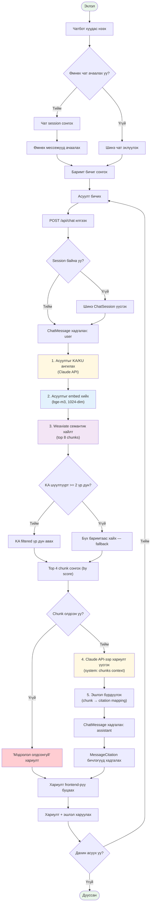

---

## 2. Ерөнхий архитектурын диаграмм

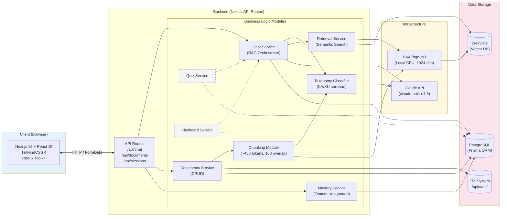

---

## 3. Use Case диаграмм

### 3.1 Суралцагчийн Use Case

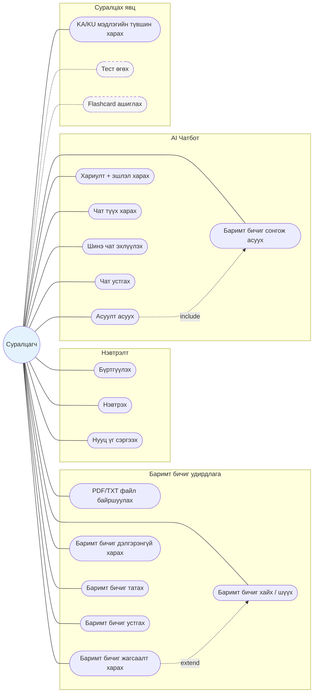

### 3.2 Системийн автомат Use Case

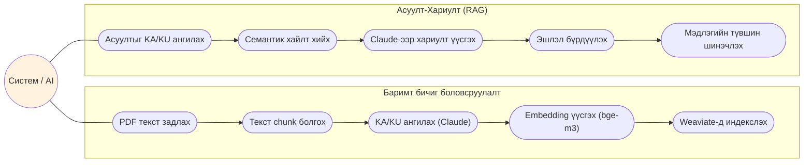

<!-- ### 3.3 Админы Use Case (Phase 3 — төлөвлөгдсөн)

```mermaid
flowchart LR
    Admin(("Админ"))

    subgraph UC_Admin ["Админ удирдлага"]
        UC30(["Хэрэглэгчдийн жагсаалт"])
        UC31(["Taxonomy удирдах"])
        UC32(["Аналитик харах"])
        UC33(["Документ хяналт"])
    end

    Admin -.- UC30
    Admin -.- UC31
    Admin -.- UC32
    Admin -.- UC33

    style UC30 fill:#f5f5f5,stroke-dasharray: 5 5
    style UC31 fill:#f5f5f5,stroke-dasharray: 5 5
    style UC32 fill:#f5f5f5,stroke-dasharray: 5 5
    style UC33 fill:#f5f5f5,stroke-dasharray: 5 5
    style UC_Admin fill:#f5f5f5,stroke-dasharray: 5 5
    style Admin fill:#fce4ec
``` -->

---

## 4. Sequence Diagram — RAG Pipeline (Асуулт-Хариулт)

```mermaid
sequenceDiagram
    actor User as Суралцагч
    participant FE as Frontend
    participant API as /api/chat
    participant DB as PostgreSQL
    participant TAX as Taxonomy Classifier
    participant LLM as Claude API
    participant EMB as bge-m3 Embedding
    participant WV as Weaviate

    User->>FE: Асуулт бичиж илгээх
    FE->>API: POST /api/chat (question, sessionId, documentIds)

    alt Шинэ чат
        API->>DB: ChatSession үүсгэх
        DB-->>API: sessionId
    end

    API->>DB: ChatMessage хадгалах (role: user)

    rect rgb(255, 248, 225)
        Note over API,LLM: 1. Асуултыг ангилах (Taxonomy Classification)
        API->>TAX: classifyChunk(question)
        TAX->>LLM: claude-haiku-4-5 (text → KA/KU)
        LLM-->>TAX: { kaCode, kuCode }
        TAX-->>API: { kaCode, kuCode }
    end

    rect rgb(225, 245, 254)
        Note over API,WV: 2. Семантик хайлт (Retrieval)
        API->>EMB: embedText(question)
        EMB-->>API: queryVector [1024-dim]
        API->>WV: nearVector(queryVector, kaCode filter)
        alt KA шүүлтүүртэй >= 2 үр дүн
            WV-->>API: top 8 chunks (KA filtered)
        else Үр дүн < 2
            API->>WV: nearVector(queryVector, no KA filter)
            WV-->>API: top 8 chunks (unfiltered)
        end
        Note over API: Top 4 chunks сонгох (by score)
    end

    rect rgb(232, 245, 233)
        Note over API,LLM: 3. Хариулт үүсгэх (Answer Generation)
        API->>LLM: claude-haiku-4-5 (system: context + chunks, user: question)
        LLM-->>API: answer text with [1],[2]... references
    end

    rect rgb(243, 229, 245)
        Note over API,DB: 4. Хадгалах + Citation
        API->>DB: ChatMessage хадгалах (role: assistant)
        API->>DB: MessageCitation хадгалах (chunk → message mapping)
    end

    API-->>FE: { sessionId, answer, citations[], kaCode, kuCode }
    FE-->>User: Хариулт + иш татгаа харуулах
```

---

## 4.1 RAG Pipeline — Mermaid биш (Markdown Text Diagram)

```text
[User]
    |
    | 1) Асуулт оруулах + documentIds сонгох
    v
[Frontend]
    |
    | POST /api/chat (question, sessionId?, documentIds[])
    v
[API Route]
    |
    |-- 2) JWT validate
    |-- 3) User message save (PostgreSQL: chat_messages)
    |
    |-- 4) Question Taxonomy Classification
    |      API -> Taxonomy Classifier -> Claude
    |      result: kaCode, kuCode
    |
    |-- 5) Retrieval
    |      5.1 Query embedding (bge-m3)
    |      5.2 Weaviate nearVector + filters(userId, documentIds, kaCode)
    |      5.3 Хэрэв KA-filter үр дүн < 2 бол fallback (kaCode-гүй)
    |      5.4 Top-8 -> Top-4 chunks selection
    |
    |-- 6) Answer Generation
    |      Claude-д context(top-4 chunks) + user question илгээх
    |      result: grounded answer
    |
    |-- 7) Citation Mapping
    |      assistant message save
    |      message_citations save (chunkId, pageNumber, score...)
    |
    |-- 8) Optional Mastery Update
    |      chat evidence record (fail бол non-blocking)
    |
    v
[API Response]
    { sessionId, answer, citations[], kaCode, kuCode }
    |
    v
[Frontend Render]
    - Хариулт
    - Эшлэл
    - Follow-up question loop

Error/Edge Paths:
- Хэрэв retrieval хоосон бол: "материалаас олдсонгүй" safe response
- Хэрэв mastery update алдаа гарвал: хариултыг буцаах хэвээр
```

---

## 4.2 RAG Pipeline — Mermaid Diagram

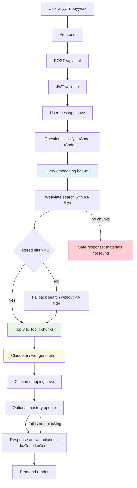

---

## 5. ER Diagram — Өгөгдлийн сангийн бүтэц

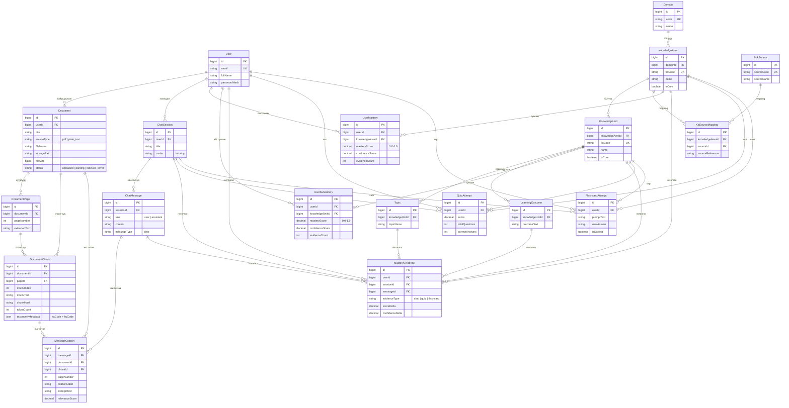
